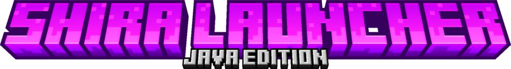

<div align="center">

<!--  -->

 
### *El launcher de Minecraft que debería haber existido desde siempre.*

[](https://github.com/Shiwaru/Shira-Highlight/releases)
[](#)
[](https://github.com/Shiwaru/Shira-Highlight/tree/main?tab=License-1-ov-file)
<br>
[](https://shiwaru.github.io/Shira/)
</div>

> [!WARNING]
> Shira Highlight está en desarrollo activo. Pueden existir características incompletas o inestables.

---

## ¿Qué es Shira Highlight?

Shira Highlight es la versión temprana de mi launcher de Minecraft No-Premium/Premium, hecho con la idea de optimizar Minecraft Java al máximo.

No es un fork, ni es un wrapper. Es un launcher propio hecho con bronca y amor, porque los launchers que existen son un desastre.


  
## ✨ Características actuales ✨

- Compatibilidad Vanilla hasta 1.21.11 🎉
- Compatibilidad Fabric desde 1.14 hasta 1.21.11 🎉
- Gestor de JVM 🎉
  - GraalVM agregado como ejecutor de JVM
  - Selector automático de Java 8, 17 o 21 según versión de Minecraft
- Intro personalizada de Mojang Studios 🎉

---

## ⚠️ Características planeadas ⚠️

### Sistema de Versiones y Modloaders

- [ ] · `Detección Multiversión` [Fabric, Forge, NeoForge] (En desarrollo) <br>
- [ ] · `Soporte Quilt`<br>
- [ ] · `Gestor de Mods`<br>
- [ ] · `Gestor de Modpacks`<br>
- [ ] · `ShiraBoost`<br>

### ☄️ Rendimiento y Optimización ☄️
<!-- 
`Forge/NeoForge` > Microsoft OpenJDK<br>
`Fabric/Quilt` > GraalVM<br>
`Vanilla` > GraalVM  
-->
- [X] · `Gestión de JVM Dinámica Default`<br>
- [X] · `Soporte GraalVM`<br>
- [ ] · `Soporte OpenJDK`<br>
- [ ] · `JVM Adaptativa`<br>
- [ ] · `Soporte OpenJ9`<br>
- [ ] · `Soporte OpenGL Mesa`<br>
- [ ] · `Soporte Shenandoah GC`<br>
- [ ] · `Soporte ZGC`<br>
- [ ] · `Garbage Collector Adaptativo`<br>
- [ ] · `Class Data Sharing` (En desarrollo)<br>
- [ ] · `Profile Guided Optimization`<br>
- [ ] · `Windows Timer Resolution`<br>
- [ ] · `ShiraProfile`<br>
- [ ] · `Sistema de Fallback Silencioso`<br>
- [ ] · `ShiraMAX`<br>

### 🔓 Seguridad y Cuentas 🔐

  - [ ] · `Inicio de sesión de Microsoft (Premium)`<br>
  - [ ] · `Cifrado DPAPI para cuentas de Microsoft (Premium)` - Para evitar que el launcher exponga cuentas a malware/virus: [Cifrado DPAPI](https://learn.microsoft.com/es-es/windows/win32/api/dpapi/nf-dpapi-cryptprotectdata)<br>
  - [ ] · `Cambio de Cuentas (Offline) In-Game`<br>

### ShiraSkin 

Concepto sin terminar.

- [ ] · `Compatibilidad con SkinsRestorer`<br> (En desarrollo)
- [ ] · `Integración con MineSkin`<br> (En desarrollo)
- [ ] · `Visibilidad en mundos LAN (ShiraMAX)`<br>

### ShiraConnect

Concepto sin terminar.

- [ ] · `Sistema de invitación de mundos` (Como Minecraft Bedrock)<br>
- [ ] · `Integración con playit.gg/ZeroTier`<br>
- [ ] · `Compatibilidad con mundos LAN` - Usando playit.gg/ZeroTier<br>

### 📌 Conceptos Internos 📌

`ShiraProfile` - Detección de hardware y optimización de configuración automática<br>
`ShiraMAX` - Agente de Java que modifica el código vanilla del juego para realizar modificaciones a los componentes de render y de video de OpenGL (Aún intentando desarrollar - Pausado)<br>
`ShiraBoost` - Fabric Performance Pack:
## ShiraBoost
| Mod | Beneficio |
|-----|-----------|
| **Sodium** | 200-300% más FPS solo. El más impactante que existe. |
| **Iris** | Shaders optimizados sin el costo brutal de OptiFine. |
| **Lithium** | Optimiza lógica del cliente/servidor. 10-20% extra. |
| **FerriteCore** | Reduce consumo de RAM hasta un 40%. |
| **Starlight** | Motor de iluminación optimizado. |
| **ModernFix** | Reduce tiempos de carga y consumo de memoria. |
| **ImmediatelyFast** | Optimiza rendering de UI y entidades. |
| **Krypton** | Optimiza el stack de red de Minecraft. |
| **Nvidium** | Para GPUs Nvidia, rendering ultra optimizado. |
| **SkinsRestorer** | Skins visibles en servidores offline (investigar compatibilidad cliente) |

---

## (DESCARTADO)
> Inclusión de ShiraSkin (Mod) si seleccionabas NeoForge 1.21.10 o 1.21.11

---

## Ideas Varias

- Animar el chat al aparecer nuevos mensajes<br>
- Cámara más lejana en F5<br>
- Sistema de cambio de cuentas dentro del juego<br>
- Paleta de colores Java igual a Bedrock<br>

---

<div align="center">

*Hecho con bronca, amor y café.*
*No me odien ❤️*

</div>

<div align="center">
  
## ⚡Tecnologías usadas 

 <br>
  
  ```
  C - C++ - Qt 6.10.2 - HTML - CCS - JavaScript - VStudio - VSCode - CMake - Gradle - Java/GraalVM/OpenJDK
  ```

</div>


Todos Los Derechos Reservados<br>
All Rights Reserved

Copyright © Shiwaru - Shira-Highlight 

> You're under no obligation to choose a license. However, without a license, the default copyright laws apply, meaning that you retain all rights to your source code and no one may reproduce, distribute, or create derivative works from your work.
> https://docs.github.com/en/repositories/managing-your-repositorys-settings-and-features/customizing-your-repository/licensing-a-repository
